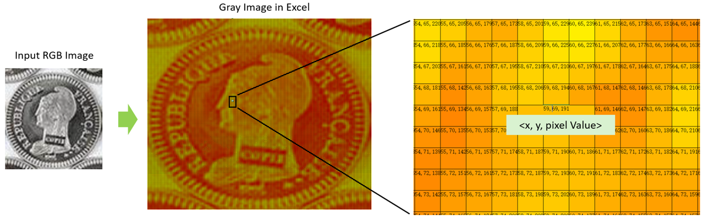

# Image Gray Scale Visualization

Image Gray Scale Visualization is a tool to check the pixel values for 2D matrix, which is possible a gray image or other types.

## Latest Updates

##### 11/28/2024 -- Basic features released

- Excel-based 1-channel gray image visualization is released.

## Installation

Image Gray Scale Visualization needn't be installed before use. But some python packages are supposed to be installed at first.

```python
pip install xlsxwriter matplotlib
```

If you are installing on Windows, it's strongly recommended to use [Windows Subsystem for Linux (WSL)](https://learn.microsoft.com/en-us/windows/wsl/install) with Ubuntu.

## Getting Started

1. Replace the image path with yours or just use the given demo image

```python
image_path = 'coin.png'
```

2. Run the main file

```python
python main.py
```

3. Result excel file is found in the same directory as main.py

```
coin.xlsx
```




